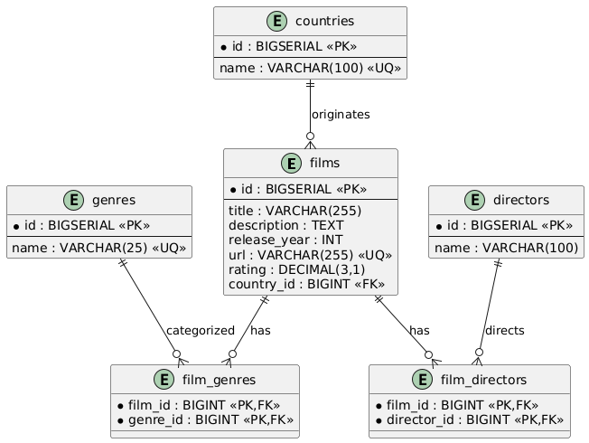
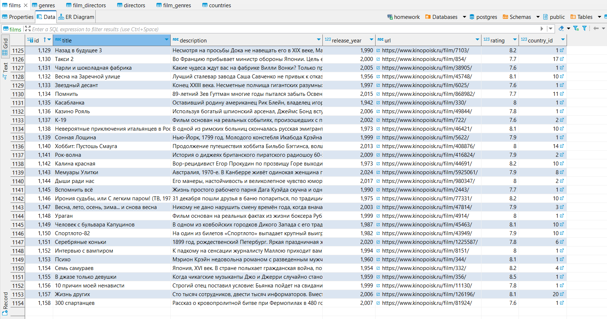
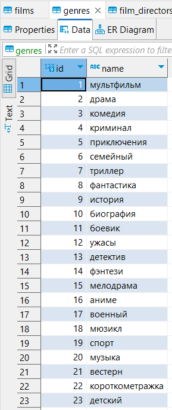
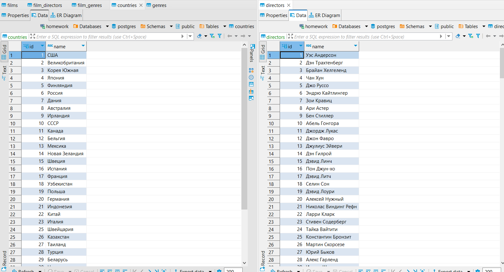

## JavaParser (Java + Spring Boot)

**Описание проекта**

Парсер собирает информацию о фильмах с сайта Kinopoisk и сохраняет в базу данных PostgreSQL через Spring Data JPA.

Задача: собрать не менее 1000 сущностей «Фильм» с параметрами: название, год выхода, описание, режиссёр, рейтинг, URL, жанры, страна.

---

### Логика работы

1. При старте приложения (`ApplicationReadyEvent`) класс `ImportRunner` вызывает `ParserService.parseTopFilms(n)`.
2. `ParserService` с помощью Selenium WebDriver загружает страницы 
списка [топ-250](https://www.kinopoisk.ru/lists/movies/top250/)/[топ-500](https://www.kinopoisk.ru/lists/movies/top500/)/[популярные](https://www.kinopoisk.ru/lists/movies/popular-films/) фильмов и собирает ссылки.
3. Для каждой ссылки загружается страница фильма и создаётся `FilmDto` с полями:
    - `title`, `year`, `description`, `director`, `rating`, `votes`, `url`, `genres`, `country`.
4. `ImportRunner` передаёт DTO в `FilmSaveService.saveMovie()`, где:
    - Проверяется, существует ли фильм по URL.
    - Создаются или извлекаются `Country`, `Genre`, `Director`.
    - Формируется сущность `Film` и сохраняется через `FilmRepository`.

---

### Модель данных и связи в БД

---

### Почему такие сущности?

Я решил выделить основные сущности `Film`, `Genre`,
`Director` и `Country`, потому что именно
они позволяют гибко анализировать и агрегировать
полученные данные. Такая структура дает возможность:

- Проводить исследования по странам происхождения фильмов.

- Анализировать популярность жанров и их пересечения.

- Исследовать вклад режиссёров в успешность фильмов.

- Гибко фильтровать и сортировать фильмы по любому из параметров.

---

  <figure style="margin: 1em; text-align: center;">
    
    <figcaption>Таблица Films</figcaption>
  </figure>

  <figure style="margin: 1em; text-align: center;">
    
    <figcaption>Таблица Genres</figcaption>
  </figure>

  <figure style="margin: 1em; text-align: center;">
    
    <figcaption>Таблицы Directors и Countries</figcaption>
  </figure>

---

### Технологии и зависимости

   - Spring Boot + Data JPA
   - Selenium WebDriver + ChromeDriver
- Flyway миграции в `resources/db/migration`
- PostgreSQL
- Maven
